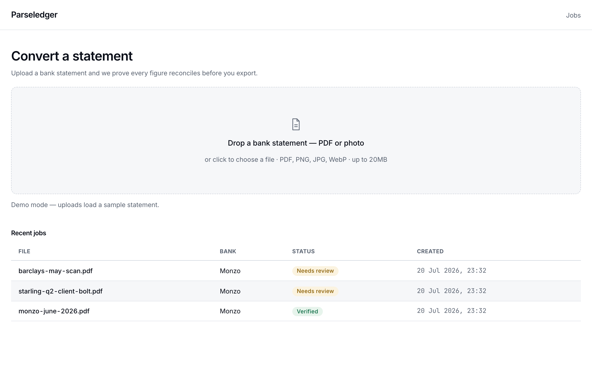
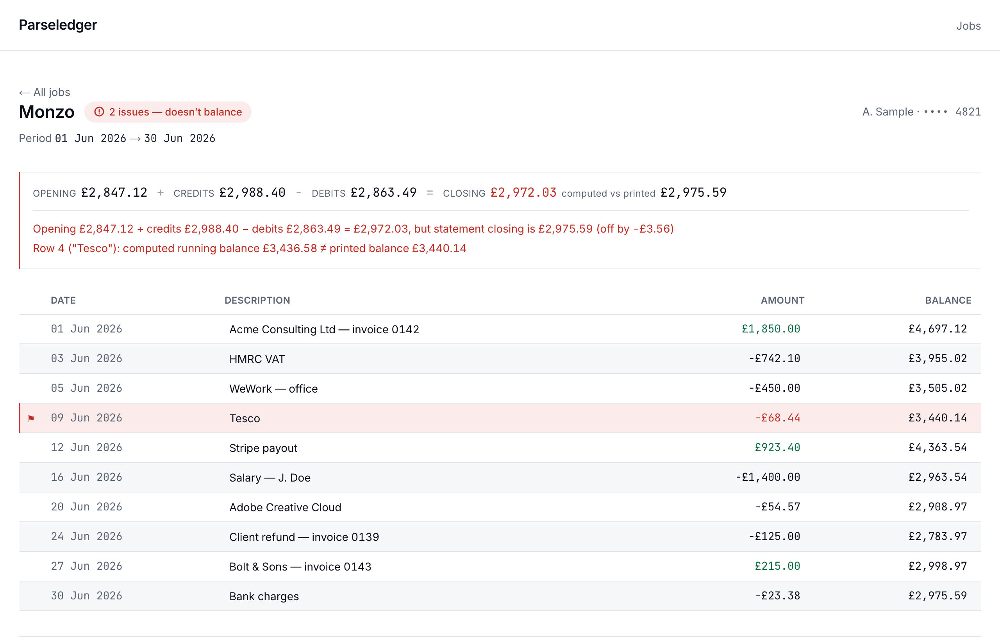
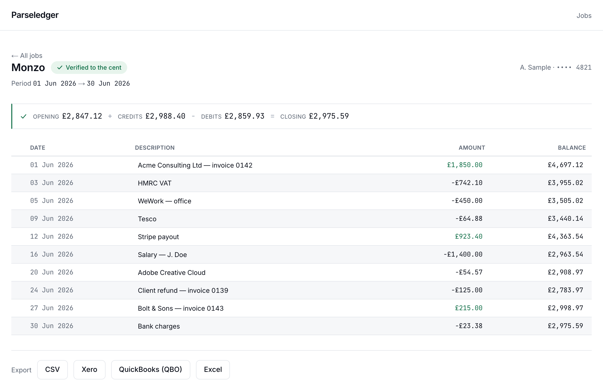

<p align="center">
  <picture>
    <source media="(prefers-color-scheme: dark)" srcset="public/screens/workspace.png">
    
  </picture>
</p>

# Parseledger

[](LICENSE)
[](https://nextjs.org)
[](https://www.typescriptlang.org)

Bank statements (PDF + scans/photos) → accounting-ready data (CSV / Excel /
QuickBooks-QBO / Xero), with every figure **proven** to reconcile before you
trust it. *Verified to the cent.*

## Screenshots

| Review — flagged | Review — verified | Workspace |
|---|---|---|
|  |  |  |

## Run it

```bash
npm i
npm test          # core + exporter tests
npm run dev       # http://localhost:3000
```

With **zero env vars** the app runs in local mode: no auth, in-memory jobs, and
uploads load a sample statement (demo mode). Copy `.env.example` to `.env.local`
and fill keys to enable the real thing:

| Env | Unlocks |
| --- | --- |
| `ANTHROPIC_API_KEY` | Real extraction (native-PDF text path via `pdftotext`, vision for scans) |
| `DATABASE_URL` | Postgres persistence (`db/schema.sql` + `db/auth-schema.sql`, Supabase EU) |
| `BETTER_AUTH_SECRET` | Accounts (better-auth), /app auth wall |
| `STRIPE_SECRET_KEY` + price ids | Billing, quotas, PAYG top-ups |

## How it's built

- `src/verification.ts` — the moat: `opening + Σcredits − Σdebits === closing`
  plus line-by-line running-balance checks. `VerificationResult` is the contract
  between extraction, the review UI and export gating.
- `src/money.ts` — money is **integer minor units** everywhere. Floats near money are bugs.
- `src/extraction.ts` — `ExtractionProvider` with a cost router: `pdftotext`
  text path for native PDFs, Claude vision for scans/photos.
- `src/export/` — CSV, Excel, QBO (OFX), Xero CSV. Pure functions, tested.
- `src/app/app/` — upload → review (live re-verification on every edit) → export.
  Export of an unverified statement requires an explicit confirmation.
- `src/app/(marketing)/` — landing + pricing + security + 60 programmatic
  `/convert/[bank]-statement-to-[format]` pages, each embedding the live demo widget.

## M0 gate

Before trusting extraction accuracy, run the Go/No-Go gate on real anonymised
statements:

```bash
ANTHROPIC_API_KEY=... npm run gate -- <dir-of-statements>
```

It reports the reconciliation pass-rate per file.

## License

[Business Source License 1.1](LICENSE) — use freely for internal purposes.
Offering Parseledger as a hosted service to third parties requires a
commercial license. Converts to MIT on 2030-07-20.
